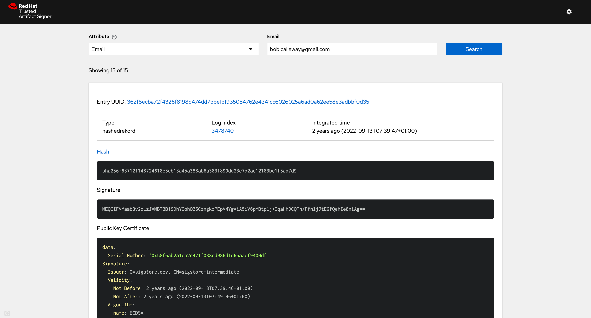

[](https://github.com/securesign/rekor-search-ui/actions/workflows/unit-tests.yaml)
[](https://cloud.cypress.io/projects/wdekco/runs)
[](https://codecov.io/gh/securesign/rekor-search-ui)

This repo contains a simple UI for searching Search the Rekor public transparency log.

https://securesign.github.io/rekor-search-ui/



## Requirements

- [Node.js](https://nodejs.org/en) 20.x+
- Access to a [Rekor server](https://github.com/securesign/rekor), or a full deployment of [Trusted Artifact Signer (TAS)](https://access.redhat.com/documentation/en-us/red_hat_trusted_artifact_signer/2024-q1/html/deployment_guide/verify_the_trusted_artifact_signer_installation)

## Getting Started

First, install the dependencies:

```bash
npm install
```

Then, run the development server:

```bash
npm run dev
```

Open [http://localhost:3000](http://localhost:3000) with your browser to see the result.

## Tests

### Unit Tests

Run all [Jest](https://jestjs.io/) and [React Testing Library](https://testing-library.com/docs/react-testing-library/intro) unit tests:

```bash
npm run test
```

Launches the test runner in the interactive watch mode.

Tests are co-located and live as closely to corresponding code as possible.

### E2E Tests

Run all [Cypress](https://www.cypress.io/) e2e tests:

```bash
npm run cy:open
```

Or in headless mode:

```bash
npm run cy:headless
```

## Stories

We use [Storybook](https://storybook.js.org/) for [Component Driven Development](https://www.componentdriven.org/) (CDD) where possible. Storybook makes it easy to keep presentational components isolated. You can learn more about how to create a story for your UI component [here](https://storybook.js.org/docs/react/writing-stories/introduction).

To run Storybook locally: `npm run storybook`

```bash
npm run storybook
```

## Deploy

The app is based on [Next.JS](https://nextjs.org/) and is automatically built & deployed to GitHub Pages when pushing to the `main` branch.

## Internal Server Configuration

This app supports overriding of the default rekor server instance for those running private instances of the Trusted Artifact Signer (TAS) stack.
Create a `.env.local` file at the root and include in it this environment variable

```properties
NEXT_PUBLIC_REKOR_DEFAULT_DOMAIN=https://privaterekor.example.com
```
